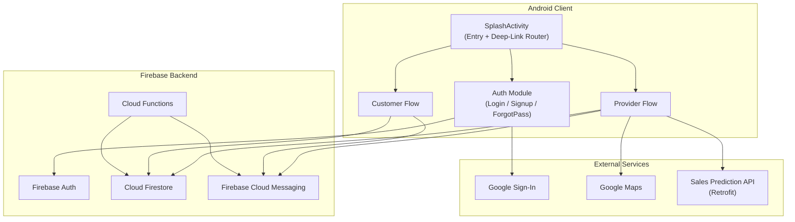
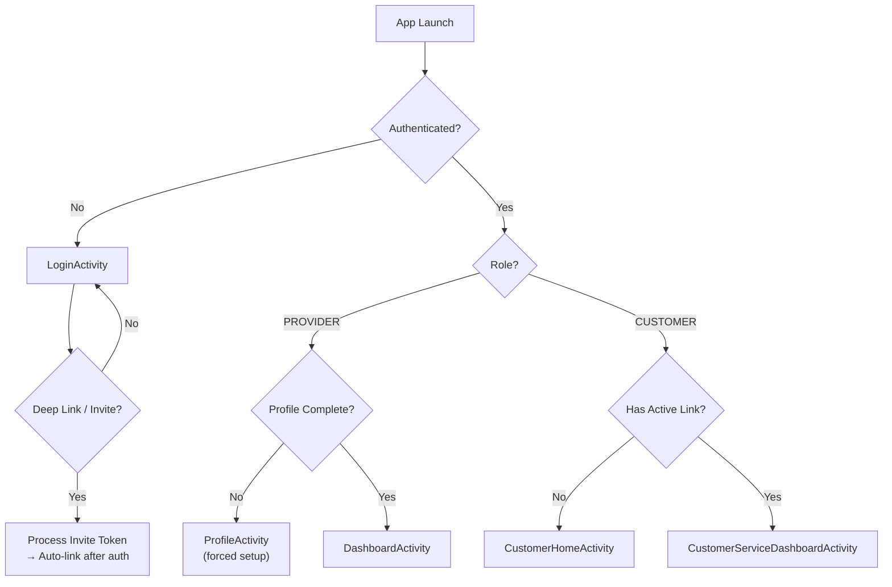
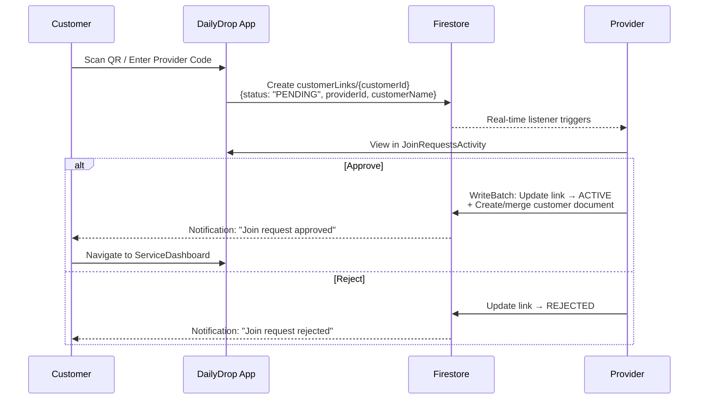
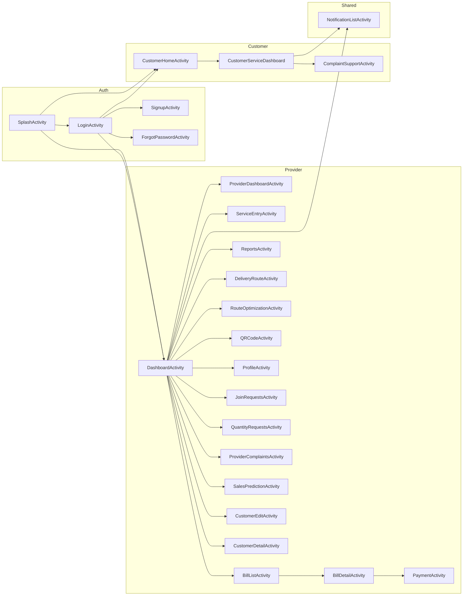
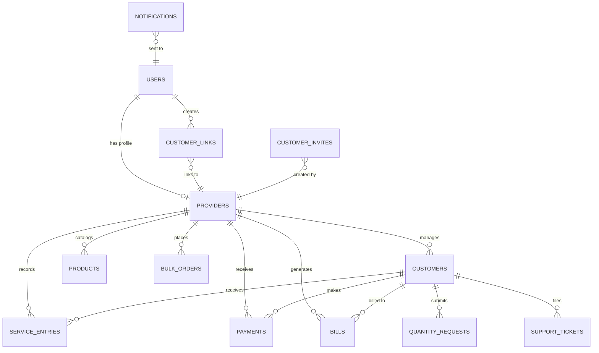

# DailyDrop — Software Requirements Specification (SR)

> **App Name:** DailyDrop (package: `com.dailyserviceapp`)  
> **Version:** 1.0 (versionCode 1)  
> **Platform:** Android (minSdk 24, targetSdk 35)  
> **Generated:** From full codebase analysis — not from README or documentation files

---

## 1. Executive Summary

**DailyDrop** is a dual-role Android application that connects **daily service providers** (milkmen, newspaper vendors, tiffin services, laundry operators, etc.) with their **customers**. It digitizes the entire daily delivery workflow — from customer onboarding via QR codes, through daily service entry and batch delivery marking, to monthly billing, payment recording, analytics, route planning, and AI-powered sales predictions.

### Key Value Propositions
| For Providers | For Customers |
|---|---|
| Batch mark deliveries for all customers in one tap | Link to providers via QR code or provider code |
| Real-time revenue & delivery analytics | View service history & billing summaries |
| Customer-wise ledger with outstanding tracking | Request extra quantities before delivery |
| Delivery route optimization with Google Maps | Download monthly bills as PDF |
| AI-powered 30-day sales predictions | Submit support tickets directly to providers |
| Offline-first with background sync | Real-time push notifications for all events |

---

## 2. System Architecture

### 2.1 Architecture Overview



### 2.2 Technology Stack

| Layer | Technology |
|---|---|
| **Language** | Java (primary) + Kotlin (data models) |
| **Build** | Gradle with Android Gradle Plugin |
| **DI** | Dagger Hilt (`@AndroidEntryPoint`, `@Inject`) |
| **UI** | Material Design Components, ViewBinding, ConstraintLayout |
| **Navigation** | AndroidX Navigation (Fragment + UI) |
| **Database** | Firebase Firestore (primary), Room (local), SharedPreferences (cache) |
| **Auth** | Firebase Authentication + Google Sign-In |
| **Notifications** | Firebase Cloud Messaging (FCM) + Cloud Functions trigger |
| **Charts** | MPAndroidChart (Bar + Pie charts) |
| **PDF** | Android `PdfDocument` API + iText 7 |
| **QR** | ZXing (generation + scanning via `zxing-android-embedded`) |
| **Networking** | Retrofit 2 + OkHttp (for Sales Prediction API) |
| **Image Loading** | Glide |
| **Animations** | AndroidX DynamicAnimation, Facebook Shimmer, ValueAnimator |
| **Background** | WorkManager (periodic + one-shot sync) |
| **Pagination** | AndroidX Paging 3 |
| **Serialization** | Gson (offline cache), Firestore auto-mapping |

### 2.3 Module Structure

```
com.dailyserviceapp/
├── SplashActivity              # Entry point, deep-link router
├── DailyDropApp                # Hilt Application class
├── auth/                       # Login, Signup, ForgotPassword
├── dashboard/                  # DashboardActivity, ProviderDashboardActivity
├── customer/                   # CustomerHome, CustomerServiceDashboard, ComplaintSupport
├── provider/                   # JoinRequests, QuantityRequests, ProviderComplaints
├── service/                    # ServiceEntry (batch delivery marking)
├── billing/                    # BillList, BillDetail, CustomerLedger, PDF generation
├── payment/                    # Payment recording
├── reports/                    # Revenue & delivery analytics with charts
├── route/                      # DeliveryRoute (area-sorted stop list)
├── maps/                       # RouteOptimizationActivity
├── qr/                         # QR code generation, share, save
├── notifications/              # FCMService, NotificationHelper, NotificationList
├── profile/                    # Provider profile setup/edit
├── sales/                      # SalesPrediction (AI-powered forecasting)
├── ai/                         # AITrainingDataGenerator (JSONL export)
├── export/                     # ExportManager, ExcelDocumentGenerator
├── ui/                         # CustomerEdit, CustomerDetail
├── core/
│   ├── base/                   # BaseActivity, BaseFragment, BaseViewModel
│   ├── offline/                # OfflineCache (Gson-backed)
│   ├── sync/                   # SyncWorkScheduler, PendingEntriesSyncWorker
│   ├── ui/                     # PremiumMotionController (entrance animations)
│   └── utils/                  # Constants, CurrencyUtils, DateUtils, ValidationUtils,
│                               # NetworkMonitor, PreferenceManager, MessagingUtils, AvatarUtils
└── data/
    ├── FirestoreRepository     # Central Firestore data access layer
    └── models/                 # Customer, ServiceEntry, Payment, Bill, Notification,
                                # QuantityRequest, Complaint, Provider, User, Product
```

---

## 3. User Roles & Access Control

### 3.1 Role Definitions

| Role | Constant | Description |
|---|---|---|
| **Provider** | `ROLE_PROVIDER` | Service providers who manage customers, mark deliveries, generate bills |
| **Customer** | `ROLE_CUSTOMER` | End consumers who receive daily services |
| **Admin** | `ROLE_ADMIN` | Reserved role (present in constants, not yet implemented in UI) |

### 3.2 Role Selection & Routing

Role is selected during signup and persisted in both Firebase Firestore (`users` collection) and local SharedPreferences. The `SplashActivity` routes users:



---

## 4. Feature Specifications

### 4.1 Authentication Module

#### FR-AUTH-01: Email/Password Authentication
- **Signup** (`SignupActivity`): Email, password, name, role selection (Provider/Customer)
  - Password validation: minimum 8 characters
  - Phone validation: exactly 10 digits
  - Creates user document in `users` Firestore collection
  - Saves FCM token immediately after registration
- **Login** (`LoginActivity`): Email + password authentication via Firebase Auth
  - On success: fetches user role from Firestore → routes to appropriate dashboard
  - Error handling: invalid credentials, network errors, disabled accounts

#### FR-AUTH-02: Google Sign-In
- Uses `GoogleSignInOptions` with `requestIdToken` (from `default_web_client_id`)
- Creates or merges user profile in Firestore on first Google sign-in
- Supports role detection for existing accounts

#### FR-AUTH-03: Password Reset
- `ForgotPasswordActivity`: Sends Firebase password reset email
- Input validation for email format

#### FR-AUTH-04: Session Management
- `PreferenceManager` stores: userId, userRole, userName, userEmail, isLoggedIn
- `BaseActivity.isLoggedIn()` gate on all protected screens
- Logout: clears preferences → signs out Firebase Auth → signs out Google → navigates to Login

---

### 4.2 Provider Dashboard

#### FR-DASH-01: Main Dashboard (`DashboardActivity`)
- **Customer List** with Paging 3 or local filtering (search with debouncing)
- **Analytics Cards** (cached in SharedPreferences for instant display):
  - Total Customers
  - Today's Deliveries
  - Today's Revenue
  - Monthly Revenue
- **Navigation Menu** to all provider modules:
  - Service Entry, Bills, Reports, Delivery Route, QR Code, Profile, Notifications, Join Requests, Quantity Requests, Sales Prediction

#### FR-DASH-02: Provider Dashboard (`ProviderDashboardActivity`)
- Secondary analytics-focused dashboard
- Displays high-level metrics: today's deliveries, today's earnings, total lent, total received, pending amount, monthly earnings, monthly deliveries
- Quick-access tiles: Service Entry, Join Requests

---

### 4.3 Customer Dashboard

#### FR-CUST-01: Customer Home (`CustomerHomeActivity`)
- **Provider Linking**: Connect to a provider using:
  - QR code scanning (camera-based)
  - Manual provider code entry (8-char uppercase code)
- **Link States**: The `customerLinks` collection tracks: `PENDING`, `ACTIVE`, `REJECTED`
- When link is `ACTIVE`, navigates to Customer Service Dashboard

#### FR-CUST-02: Customer Service Dashboard (`CustomerServiceDashboardActivity`)
- **Service History**: Displays recent service entries (date, quantity, rate, amount)
- **Payment History**: Shows recorded payments with method and date
- **Billing Summary**: Total service amount, total paid, outstanding balance
- **Extra Quantity Request** (bottom sheet):
  - Enter requested quantity and optional note
  - Creates `QuantityRequest` document with status `PENDING`
  - Sends notification to provider
- **Monthly Bill PDF** generation and download
- **Navigation**: Complaint & Support, Notifications, Logout

---

### 4.4 Service Entry Module

#### FR-SVC-01: Daily Service Entry (`ServiceEntryActivity`)
- **Date Selection**: DatePicker restricted to today and past dates (no future dates)
- **Customer List**: All active, non-vacation customers displayed with default quantities
- **Batch Operations**:
  - "Select All" / "Clear All" buttons
  - Each customer row shows: name, default quantity (editable), rate, calculated amount
- **Batch Delivery Marking**:
  - Single "Mark Delivery" button for all selected customers
  - Uses `saveServiceEntriesBatchWithTransaction()` for atomic writes
  - Duplicate detection: skips customers already marked for that date
  - Confirmation dialog for past-date entries
- **Ownership Enforcement**: Validates all customer `providerId` matches authenticated user's UID before writes

#### FR-SVC-02: Offline Service Entry
- **Offline Cache**: Customers cached via `OfflineCache` (Gson-backed SharedPreferences)
- **Queue System**: Deliveries queued as `PendingServiceEntry` when offline
- **Background Sync**: `SyncWorkScheduler` triggers `PendingEntriesSyncWorker` via WorkManager
  - Immediate sync on network restore
  - Periodic sync as safety net
- **UI Indicators**: "📴 Offline mode" indicator, pending sync count badge

---

### 4.5 Billing & Ledger Module

#### FR-BILL-01: Bill List — Customer Ledger (`BillListActivity`)
- **Live Customer Ledger**: Real-time computation from service entries + payments
- **Parallel Data Loading**: Fetches service entries and payments simultaneously using `LedgerFetchState` with `AtomicInteger` coordination
- **Per-Customer Summary**: Uses `CustomerLedgerCalculator` to compute:
  - Outstanding amount
  - Total paid amount
  - Delivered entry count
  - Paid-till date / Due-from date
- **Sorting**: By outstanding amount (descending), then by name
- **Header Stats**: Total customers, aggregate due, aggregate paid
- **Caching**: LRU cache (`MAX_CACHE_ENTRIES = 5`) with 60-second freshness window
- **Manual Refresh**: With 3-second cooldown
- **Share**: Per-customer ledger summary via Android share intent

#### FR-BILL-02: Bill Detail — Customer Ledger Detail (`BillDetailActivity`)
- **Full Ledger View** for a specific customer:
  - Customer name, payment status chip (Clear/Partial/Pending/No Service)
  - Service history (last 30 entries): date, qty × rate = amount
  - Payment history (last 25 entries): date, amount, method, notes
- **Payment Status Logic**:
  - `No Service` → no delivered entries
  - `Clear` → outstanding ≤ ε (0.01)
  - `Partial` → some paid but outstanding > ε
  - `Pending` → nothing paid, outstanding > ε
- **Actions**: Record Payment, Share Ledger

#### FR-BILL-03: Monthly Bill PDF Generation (`MonthlyBillPdfGenerator`)
- Generates A4 PDF (595×842 @72dpi) using Android `PdfDocument` API
- Content: Provider name, customer name, service type, month/year, line-item entries (date, qty, rate, amount), summary totals
- Saved to app's external documents directory
- Returns `Result` with file handle and computed totals

---

### 4.6 Payment Module

#### FR-PAY-01: Payment Recording (`PaymentActivity`)
- **Dual Mode**:
  - **Customer Mode**: Records payment against a customer's overall ledger
  - **Bill Mode**: Records payment against a specific bill document
- **Payment Methods**: Cash, UPI, Bank Transfer, Cheque, Other
- **Validation**:
  - Amount > 0, max 2 decimal places, max ₹10,00,000
  - Overpayment detection with confirmation dialog
  - Required: payment method, amount
- **Outstanding Calculation**: Real-time computation using `CustomerLedgerCalculator`
- **Bill Status Update** (bill mode): Automatically updates bill to `PAID`, `PARTIAL`, or `PENDING` based on total payments vs. bill amount
- **Notification**: Sends `PAYMENT_RECEIVED` notification to customer on successful save

---

### 4.7 Reports & Analytics Module

#### FR-RPT-01: Reports Dashboard (`ReportsActivity`)
- **Date Range Filter**: Start/end date pickers with validation
- **Summary Metrics** (with counter animations):
  - Total Revenue
  - Total Deliveries
  - Unique Active Customers
  - Total Payments Received
  - Overdue Bills Count
- **Charts** (MPAndroidChart):
  - **Bar Chart**: Top 5 customers by revenue
  - **Pie Chart**: Customer revenue share (top 4 + "Others")
  - Toggle between bar/pie with animated transitions
- **Service Breakdown**: Revenue by service type with contribution percentage
- **Top Customers**: Top 5 by revenue with formatted amounts
- **Parallel Loading**: 3 parallel Firestore queries (entries, payments, bills) coordinated with `beginLoadOperations`/`finishLoadOperation`

---

### 4.8 Delivery Route Planning

#### FR-ROUTE-01: Delivery Route (`DeliveryRouteActivity`)
- **Customer Route List**: All active, non-vacation customers sorted by:
  1. Area (alphabetical)
  2. Address (alphabetical)
  3. Name (alphabetical)
- **Stop Cards**: Stop number, customer name, area + service type, address
- **Actions per Stop**:
  - Open in Google Maps (geo: intent with fallback)
  - Call customer (tel: intent)
- **Navigate to First Stop**: Opens first customer's address in Google Maps

#### FR-ROUTE-02: Route Optimization (`RouteOptimizationActivity`)
- Listed in manifest — provides Google Maps-based route optimization

---

### 4.9 QR Code System

#### FR-QR-01: QR Code Generation (`QRCodeActivity`)
- Generates QR code from provider's Firebase UID using ZXing
- Displays: Provider business name/name, provider code (first 8 chars uppercase of UID)
- **Provider Record Sync**: Ensures provider document exists in Firestore with `providerCode` field
- **Share**: Saves QR bitmap to cache → shares via FileProvider as PNG
- **Save to Gallery**: Saves to device gallery via `MediaStore`

#### FR-QR-02: QR Code Scanning (Customer Side)
- Integrated in `CustomerHomeActivity`
- Scans provider QR → extracts provider UID → creates `customerLinks` document with `PENDING` status

---

### 4.10 Notification System

#### FR-NOTIF-01: Push Notifications (FCM)
- **FCMService** handles:
  - `onMessageReceived`: Parses data payload (title, body, type, relatedId) → shows local notification + saves to Firestore
  - `onNewToken`: Updates FCM token in `users` collection via merge
- **Cloud Function** (`sendPushNotification`):
  - Triggered on new document creation in `notifications` collection
  - Looks up user's FCM token → sends via Firebase Admin Messaging
  - Cleans stale tokens on `invalid-registration-token` errors

#### FR-NOTIF-02: In-App Notification List (`NotificationListActivity`)
- **Real-time Feed**: Firestore snapshot listener on `notifications` collection
- Filtered by current user ID, ordered by timestamp (descending), limited to 50
- **Read/Unread**: Unread items highlighted with dot indicator and full opacity
- **Mark as Read**: Tap notification → marks as read
- **Mark All Read**: Overflow menu → batch update via `WriteBatch`
- **Icon Mapping**: Different icons per notification type (bill, calendar, generic)

#### FR-NOTIF-03: Notification Types

| Type | Constant | Trigger |
|---|---|---|
| Bill Generated | `BILL_GENERATED` | New monthly bill created |
| Payment Reminder | `PAYMENT_REMINDER` | Upcoming/overdue payment |
| Payment Received | `PAYMENT_RECEIVED` | Payment successfully recorded |
| Service Delivery | `SERVICE_DELIVERY` | Service entry marked |
| Join Request | `JOIN_REQUEST` | Customer sends join request |
| Join Request Status | `JOIN_REQUEST_STATUS` | Provider approves/rejects join |
| Quantity Request | `QUANTITY_REQUEST` | Customer requests extra quantity |
| Quantity Response | `QUANTITY_RESPONSE` | Provider responds to quantity request |
| Support Ticket | `SUPPORT_TICKET` | Customer submits support ticket |
| Support Update | `SUPPORT_UPDATE` | Ticket status updated |
| Bulk Order | `BULK_ORDER` | Bulk order event |

---

### 4.11 Customer Onboarding (Join Request System)

#### FR-JOIN-01: Join Request Flow



#### FR-JOIN-02: Join Requests Management (`JoinRequestsActivity`)
- Real-time Firestore snapshot listener for `customerLinks` where `providerId` matches and status is `PENDING`
- **Approve**: Creates customer document in `customers` collection with provider's default service type, then updates link status to `ACTIVE` — all via `WriteBatch` for atomicity
- **Reject**: Confirmation dialog, then updates link status to `REJECTED`
- Handles `PERMISSION_DENIED` and `UNAVAILABLE` errors gracefully

---

### 4.12 Quantity Request System

#### FR-QTY-01: Extra Quantity Request (Customer Side)
- Bottom sheet in `CustomerServiceDashboardActivity`
- Fields: requested quantity, optional note
- Creates `QuantityRequest` document: customerId, providerId, customerName, serviceType, currentQuantity, requestedQuantity, requestDate, status=PENDING
- Sends `QUANTITY_REQUEST` notification to provider

#### FR-QTY-02: Quantity Request Management (`QuantityRequestsActivity`)
- Lists all `PENDING` requests for the authenticated provider
- **Request Card**: Customer name/initial, service type badge, current qty, requested qty, extra qty (+delta), request date, relative timestamp ("5 min ago"), optional note
- **Approve**: Updates status to `APPROVED`, adds `respondedAt` timestamp, sends `QUANTITY_RESPONSE` notification to customer
- **Reject**: Updates status to `REJECTED` with same pattern

---

### 4.13 Complaint & Support System

#### FR-SUPP-01: Customer Complaint Submission (`ComplaintSupportActivity`)
- **Categories**: Delivery Issue, Billing Issue, Payment Issue, App Issue, Other
- **Fields**: Subject (required), message (required), category
- Creates `supportTickets` document with: customerId, providerId, customerName, customerEmail, providerName, providerEmail, category, subject, message, status=OPEN
- Sends `SUPPORT_TICKET` notification to provider
- **Ticket History**: Lists last 20 tickets with date, category, status badge

#### FR-SUPP-02: Email Provider
- Direct email via `ACTION_SENDTO` intent with pre-filled subject and body template
- Provider email resolved from `providers` or `users` collection

#### FR-SUPP-03: Provider Complaints View (`ProviderComplaintsActivity`)
- Listed in manifest — allows providers to view and manage customer complaints

---

### 4.14 Provider Profile Module

#### FR-PROF-01: Profile Setup & Edit (`ProfileActivity`)
- **Required Fields**: Business name, owner name, phone (validated), address
- **Optional Fields**: Area, city, GST number, UPI ID, notes
- **Service Selection** (ChipGroup): Milk, Newspaper, Water, Tiffin, Laundry, Maid, Other (with custom text input)
- **Provider Code**: Auto-generated first 8 uppercase characters of Firebase UID
- **Forced Setup**: `EXTRA_FORCE_PROFILE_SETUP` flag blocks navigation until profile is complete
- **View/Edit Toggle**: Read-only mode with edit button in toolbar; switches to edit mode
- **Firestore Merge**: Uses `SetOptions.merge()` to preserve existing fields

---

### 4.15 Sales Prediction Module (AI)

#### FR-SALES-01: Sales Prediction Dashboard (`SalesPredictionActivity`)
- **External API**: Calls prediction backend via Retrofit 2
- **Data Display**:
  - Total predicted quantity (units)
  - Total predicted revenue (animated counter)
  - Top category identification
  - Per-category breakdown: active customers, daily revenue, 30-day forecast
  - Revenue share pie chart with animated reveal
  - Category progress bars with staggered animation
- **Error Handling**: User-friendly error messages for "no active customers", invalid categories, network errors
- **Retry**: Manual retry button on failure

#### FR-SALES-02: AI Training Data Export (`AITrainingDataGenerator`)
- Exports support ticket data as JSONL training dataset
- Fields: ticketId, providerId, customerId, names, emails, category, subject, message, status, timestamps
- Saved to app's external documents directory
- Background thread execution with main-thread callback

---

### 4.16 Data Export Module

#### FR-EXPORT-01: Export System
- `ExportManager` and `ExportConfig` for configurable exports
- `ExcelDocumentGenerator` for Excel file generation
- Used for exporting customer data, service history, billing reports

---

### 4.17 Customer Management

#### FR-CMGMT-01: Customer CRUD
- **Customer Edit** (`CustomerEditActivity`): Add/edit customer details — name, phone, address, area, service type, rate per unit, default quantity, lent amount, notes
- **Customer Detail** (`CustomerDetailActivity`): View customer information, service history, payment history
- **Customer Status**: ACTIVE / inactive
- **Vacation Mode**: `onVacation` flag — vacation customers filtered from service entry

---

### 4.18 Deep Linking & Invites

#### FR-LINK-01: Customer Invite Deep Links
- **URI Schemes**:
  - `dailydrop://invite/{token}`
  - `https://dailydrop.app/invite/{token}`
- **Flow**: SplashActivity intercepts deep link → caches invite token → routes to auth → after login, processes invite via `customerInvites` collection
- **Invite Lifecycle**: PENDING → CLAIMED (with claimedByUserId)

---

## 5. Data Models

### 5.1 Firestore Collections

| Collection | Document Key | Description |
|---|---|---|
| `users` | Firebase UID | Auth profile, role, FCM token |
| `providers` | Firebase UID | Provider business profile, services, providerCode |
| `customers` | Firebase UID or auto-ID | Customer profile linked to a provider |
| `customerLinks` | Customer UID | Provider-customer linkage with status |
| `customerInvites` | Token hash | Invite tokens for deep-link onboarding |
| `serviceEntries` | Auto-generated | Daily delivery records |
| `bills` | Auto-generated | Monthly billing statements |
| `payments` | Auto-generated | Payment transactions |
| `notifications` | Auto-generated | In-app notifications |
| `quantityRequests` | Auto-generated | Extra quantity requests |
| `supportTickets` | Auto-generated | Complaint/support tickets |
| `joinRequests` | Auto-generated | Provider join requests |
| `bulkOrders` | Auto-generated | Bulk order records |
| `products` | Auto-generated | Product catalog |

### 5.2 Core Data Models

#### Customer (Kotlin)
```
id: String?               // Firestore @DocumentId
name: String?
phone: String?
address: String?
area: String?
serviceType: String?
ratePerUnit: Double        // Default: 0.0
defaultQuantity: Double    // Default: 1.0
lentAmount: Double         // Default: 0.0
providerId: String?
status: String?            // Default: "ACTIVE"
notes: String?
onVacation: Boolean        // Default: false
startDate: Timestamp?
createdAt: Timestamp?
```

#### ServiceEntry (Kotlin)
```
id: String?               // Firestore @DocumentId
providerId: String?
customerId: String?
date: Timestamp?
quantity: Double           // Default: 0.0
rate: Double               // Default: 0.0
delivered: Boolean         // Default: false
notes: String?
createdAt: Timestamp?
updatedAt: Timestamp?
```

#### Payment (Java)
```
id: String                 // Firestore @DocumentId
billId: String             // Associated bill (nullable for ledger payments)
providerId: String
customerId: String
amount: double
paymentMethod: String      // Cash, UPI, Bank Transfer, Cheque, Other
paymentDate: Timestamp
notes: String
createdAt: Timestamp
```

#### Bill (Java)
```
id: String                 // Firestore @DocumentId
providerId: String
customerId: String
month: int                 // 0-11 (Jan=0)
year: int
totalAmount: double
daysServed: int
paymentStatus: String      // PENDING, PARTIAL, PAID, OVERDUE
pdfUrl: String
items: List<BillItem>      // {description, rate, quantity, amount}
extras: List<ExtraCharge>  // {description, amount}
adjustments: List<Adjustment> // {description, amount ± }
createdAt: Timestamp
dueDate: Timestamp
```

#### QuantityRequest (Java)
```
id: String                 // Firestore @DocumentId
customerId: String
providerId: String
customerName: String
serviceType: String
currentQuantity: double
requestedQuantity: double
requestDate: Timestamp
status: String             // PENDING, APPROVED, REJECTED
note: String
respondedAt: Timestamp
createdAt: Timestamp
```

#### Notification (Java)
```
id: String                 // Firestore @DocumentId
userId: String
title: String
message: String
type: String               // BILL_GENERATED, PAYMENT_RECEIVED, etc.
read: boolean
relatedId: String
timestamp: Timestamp
```

#### Complaint (Java)
```
id: String                 // Firestore @DocumentId
providerId: String
customerId: String
providerName: String
providerEmail: String
customerName: String
customerEmail: String
category: String           // Delivery Issue, Billing Issue, etc.
subject: String
message: String
status: String             // OPEN, IN_PROGRESS, RESOLVED
createdAt: Timestamp
updatedAt: Timestamp
resolvedAt: Timestamp
```

---

## 6. Security Rules (Firestore)

### 6.1 Core Principles
- **All access requires authentication** (`isSignedIn()`)
- **Provider ownership**: Providers can only access customers/entries/payments where `providerId == auth.uid`
- **Customer self-access**: Customers can access their own links, requests, and notifications
- **Cross-collection validation**: `ownsCustomer()` function validates customer-provider relationship before service entry or payment creation

### 6.2 Access Rules Summary

| Collection | Read | Create | Update | Delete |
|---|---|---|---|---|
| `providers` | Any signed-in user | Owner only (userId match) | Owner only | Owner only |
| `users` | Owner only | Owner only | Owner only | Owner only |
| `customers` | Owner or linked provider | Provider (providerId match) | Linked provider | Linked provider |
| `customerLinks` | Owner or linked provider | Owner or provider | Owner or provider | Owner or provider |
| `serviceEntries` | Provider or customer | Provider (with `ownsCustomer` check) | Provider | Provider |
| `payments` | Provider or customer | Provider (with `ownsCustomer` check) | Provider | Provider |
| `bills` | Provider or customer | Provider (with `ownsCustomer` check) | Provider | Provider |
| `notifications` | Owner only | Owner or linked user (via customerLinks validation) | Owner only | Owner only |
| `quantityRequests` | Customer or provider | Customer (status=PENDING) | Provider only | Never |
| `supportTickets` | Customer or provider | Customer only | Customer or provider | Never |
| `joinRequests` | Customer or provider | Customer only | Provider only | Provider only |
| `bulkOrders` | Provider only | Provider only | Provider only | Provider only |
| `products` | Provider only | Provider only | Provider only | Provider only |

---

## 7. Cloud Functions

### 7.1 Push Notification Dispatcher

**Trigger**: `onDocumentCreated("notifications/{notifId}")`

**Flow**:
1. New notification document created in Firestore
2. Function reads `userId` field
3. Looks up FCM token from `users/{userId}` document
4. Sends FCM data message with `high` priority containing: title, body, type, relatedId
5. On stale token error: deletes the `fcmToken` field from user document

---

## 8. Offline-First Architecture

### 8.1 OfflineCache
- **Backing Store**: Gson-serialized data in SharedPreferences
- **Cached Data**: Customer list, pending service entries
- **API**: `cacheCustomers()`, `getCachedCustomers()`, `queuePendingEntry()`, `getPendingEntries()`

### 8.2 SyncWorkScheduler
- **Immediate Sync**: `enqueueImmediateSync()` — OneTimeWorkRequest when network becomes available
- **Periodic Sync**: `ensurePeriodicSync()` — ensures background sync runs regularly
- **Worker**: `PendingEntriesSyncWorker` — dequeues pending entries, writes to Firestore, handles failures with retry

### 8.3 Sync Indicators
- Offline mode text indicator ("📴 Offline mode")
- Pending sync card with entry count ("📤 3 deliveries pending sync")
- Automatic data reload on activity resume

---

## 9. UI/UX Design System

### 9.1 Base Activity Infrastructure
- `BaseActivity`: All activities extend this. Provides: toolbar setup with system bar insets, network monitoring, user session helpers, logout, premium motion binding
- `BaseFragment` / `BaseViewModel`: Fragment and ViewModel base classes

### 9.2 Premium Motion System (`PremiumMotionController`)
- Automatic staggered entrance animations on all screens
- Applied globally via `bindPremiumMotion()` in `BaseActivity.setContentView()`

### 9.3 Theming
- Material Design 3 theme (`Theme.DailyServiceApp`)
- Custom color system: primary, secondary, surface, with light/dark variants
- Chart-specific colors: `chart_pending`, `chart_paid`, `chart_overdue`, `brand_sky_500`
- Shimmer loading states (Facebook Shimmer library)

### 9.4 Key UI Patterns
- ViewBinding throughout (no `findViewById` in new code)
- RecyclerView with custom adapters for all lists
- Material AlertDialogs for confirmations
- Material Chips for service type selection
- Bottom sheets for quantity requests
- SnackBar for non-blocking feedback
- Animated value counters with `DecelerateInterpolator`
- Empty state layouts with descriptive messages

---

## 10. Permissions

| Permission | Usage | Required |
|---|---|---|
| `INTERNET` | All Firebase and API communications | Yes |
| `ACCESS_NETWORK_STATE` | Offline detection | Yes |
| `CAMERA` | QR code scanning | No (optional feature) |
| `POST_NOTIFICATIONS` | Push notifications (Android 13+) | No (runtime) |
| `SEND_SMS` | SMS notifications to customers | No (optional) |
| `WRITE_EXTERNAL_STORAGE` | PDF/QR save (≤ API 28) | Legacy only |
| `READ_EXTERNAL_STORAGE` | File access (≤ API 32) | Legacy only |

---

## 11. Build & Release Configuration

| Setting | Value |
|---|---|
| `compileSdk` | 35 |
| `minSdk` | 24 (Android 7.0) |
| `targetSdk` | 35 (Android 15) |
| `applicationId` | `com.dailyserviceapp` |
| `versionCode` | 1 |
| `versionName` | 1.0 |
| Java compatibility | Java 17 |
| Kotlin JVM target | 17 |
| Core library desugaring | Enabled (java.time on API 24+) |
| Release minify | Enabled (R8/ProGuard) |
| Release shrinkResources | Enabled |
| ViewBinding | Enabled |

---

## 12. Integration Points

| Integration | Library/Service | Purpose |
|---|---|---|
| Firebase Auth | `firebase-auth` | User authentication |
| Cloud Firestore | `firebase-firestore` | Primary database (real-time sync) |
| Firebase Storage | `firebase-storage` | File storage (PDFs, images) |
| Firebase Messaging | `firebase-messaging` | Push notifications |
| Firebase Analytics | `firebase-analytics` | Usage tracking |
| Firebase Crashlytics | `firebase-crashlytics` | Crash reporting |
| Google Sign-In | `play-services-auth` | OAuth authentication |
| Google Maps | Maps intent (`geo:`) | Delivery navigation |
| ZXing | `zxing-core` + `zxing-android-embedded` | QR generation & scanning |
| MPAndroidChart | `MPAndroidChart:v3.1.0` | Bar & Pie charts |
| Retrofit 2 | `retrofit:2.11.0` | Sales prediction API calls |
| Glide | `glide:4.16.0` | Image loading/caching |
| Shimmer | `shimmer:0.5.0` | Loading placeholder animations |
| iText 7 | `itext7-core:7.2.5` | Advanced PDF generation |

---

## 13. Non-Functional Requirements

### 13.1 Performance
- **Paging 3** for large customer lists (configurable `PAGE_SIZE = 50`)
- **LRU Cache** for ledger summaries (5 entries, 60-second freshness)
- **Manual Refresh Cooldown**: 3-second debounce on billing refresh
- **View recycling**: `setHasFixedSize(true)` on stable RecyclerViews
- **UI guard**: `isUiActive()` check before all Firestore callbacks to prevent crashes

### 13.2 Reliability
- **Offline-first**: All critical flows (service entry) work without internet
- **Transactional writes**: Batch delivery marking uses Firestore transactions
- **Ownership enforcement**: Multi-point validation of provider-customer relationships
- **Session refresh**: Automatic `providerId` alignment on UID mismatch

### 13.3 Security
- **Firestore Rules**: 275 lines of comprehensive security rules
- **No cleartext traffic**: `android:usesCleartextTraffic="false"` + network security config
- **Token refresh**: FCM token management with stale token cleanup
- **Provider isolation**: Complete data isolation between providers

### 13.4 Scalability
- **WorkManager** for reliable background processing
- **Parallel Firestore queries** with atomic coordination
- **Cloud Functions** for server-side push notification delivery
- **Pagination** prevents loading unbounded datasets

---

## Appendix A: Screen Flow Map



---

## Appendix B: Firestore Collection Schema Diagram


