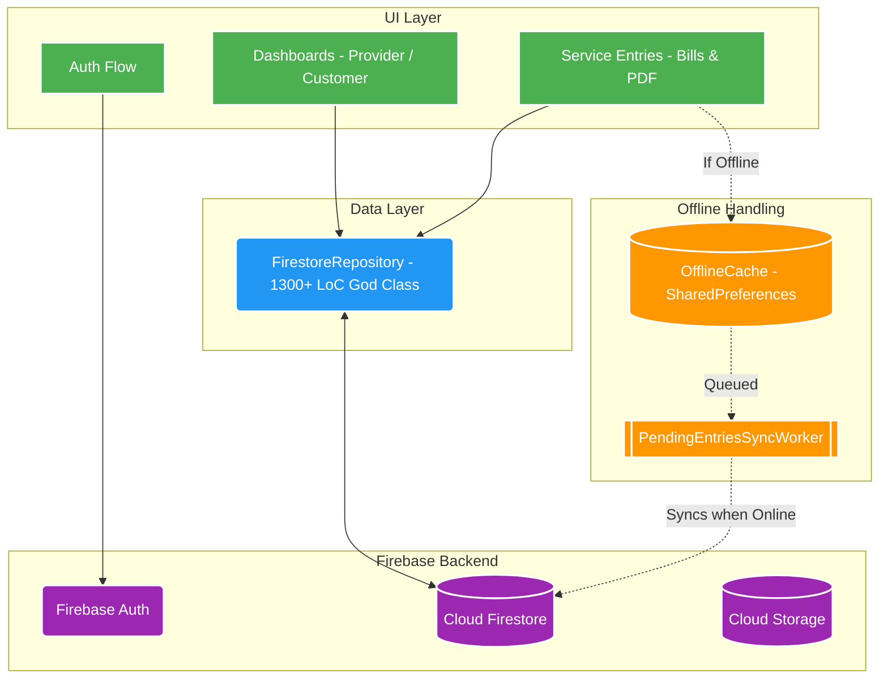
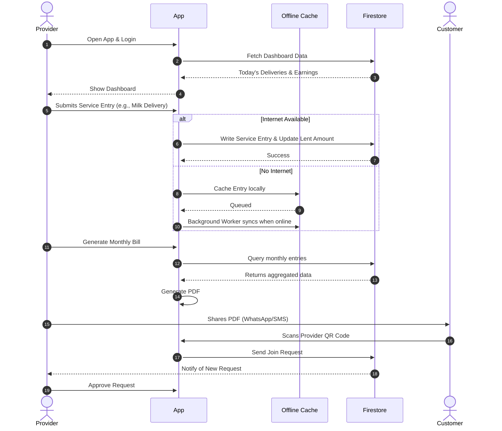
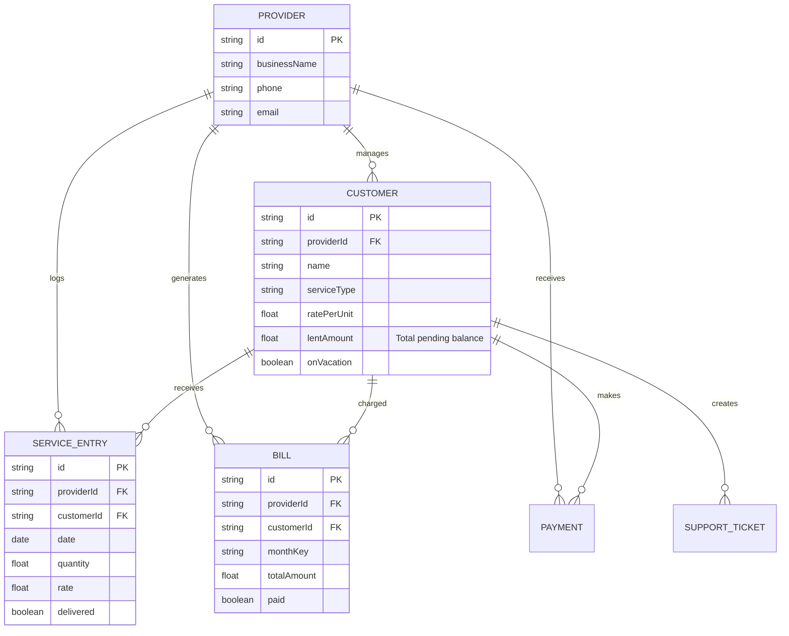
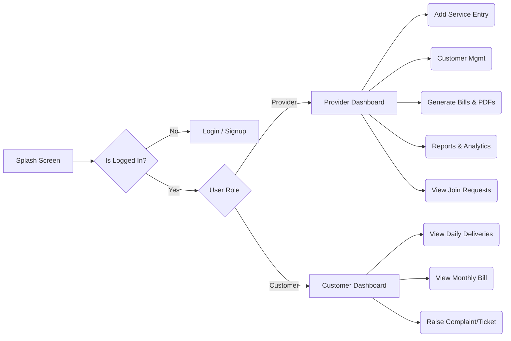

# 🧩 DailyServiceApp — Architecture & Flow Poster

This artifact provides a high-level visual representation of the project's architecture, user flows, and data relationships. 

---

## 🏛️ 1. High-Level Architecture
The app currently follows a monolithic, direct-access architecture where the UI layer talks directly to the data layer.

---

## 🔄 2. Core User Journey / Flow

The app serves two primary personas: **Providers** (business owners) and **Customers** (subscribers). Here's how they interact.

---

## 🗄️ 3. Entity-Relationship (ER) Schema

The NoSQL database structure, mapped to a relational visualization to understand the connections between collections.

---

## 🚦 4. App Flowchart — Navigation Tree

